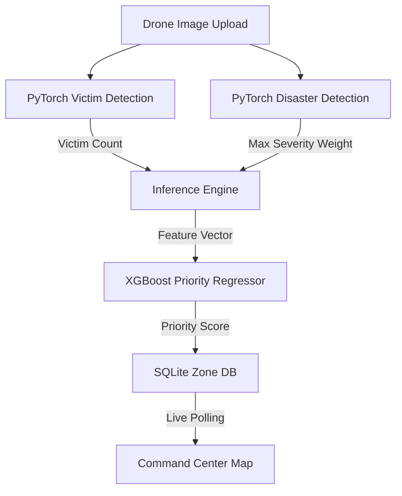

# 🚨 Disaster Saviour — AI-Powered Drone Disaster Response App

[](LICENSE)
[](https://fastapi.tiangolo.com/)
[](https://xgboost.readthedocs.io/)

**Disaster Saviour** is a single-server, offline-first emergency coordination platform built for rapid deployment. Designed for hackathons and search-and-rescue operations, it processes drone telemetry and images locally to detect victims, classify disaster severity, rank rescue priority using AI, and coordinate real-time dispatch on an interactive map.

---

## 🛠️ Tech Stack & Key Design Choices

| Layer | Choice | Rationale |
| :--- | :--- | :--- |
| **Backend** | **FastAPI** | Single-server ASGI framework that handles API routes and directly serves the static HTML/CSS/JS frontend. |
| **Database** | **SQLite + SQLAlchemy ORM** | Zero-setup database. A single-file SQLite database (`disaster_app.db`) that operates fully offline without cloud dependencies. |
| **Security & Auth** | **Session Cookies & Passlib** | Secure session-cookie authentication using Starlette's `SessionMiddleware` and `bcrypt` password hashing. |
| **Machine Learning** | **Ultralytics YOLO + XGBoost** | Local PyTorch inference with Ultralytics for YOLO models (Victim + Disaster) and a priority scoring XGBoost Regressor. |
| **Frontend** | **Vanilla HTML5 / CSS3 / Leaflet.js** | Premium, dark-themed responsive design featuring Leaflet maps, custom markers, custom CSS animations, and zero-build setup. |

---

## 🚀 Key Features

*   **🔒 Secure Multi-Operator Portal:** Includes an operators-only signup and login screen styled with dynamic particle effects.
*   **👥 Active Operator Panel:** A live-polling panel that shows all currently logged-in operators and active sessions.
*   **🛰️ Drone Telemetry Upload:** Upload drone images and target coordinates. Features **EXIF GPS auto-detection** which falls back to a map picker if GPS metadata is missing.
*   **🧠 Dual PyTorch Model Inference:**
    *   **Victim Model:** Detects human victims at a `0.4` confidence threshold.
    *   **Disaster Model:** Detects damage categories (`fire`, `flood`, `landslide`, `damaged_building`, `collapse`) and resolves weights dynamically.
*   **📊 XGBoost Priority Ranking:** Computes real-time rescue priority scores using a custom regression model trained on features: `[victim_count, severity_score]`.
*   **🗺️ Live Command Center Map:** Updates dynamically via JS polling (every 4 seconds) to show color-coded severity markers (Critical, High, Medium, Low) and rescue logs.

---

## 📁 Project Structure

```text
disaster-saviour/
├── ARCHITECTURE.md          ← Core architecture design and development prompts
├── Dockerfile               ← Containerization configuration
├── LICENSE                  ← MIT open-source license file
├── main.py                  ← FastAPI backend, database seed, and API endpoints
├── auth.py                  ← Authentication routes, password hashing, and sessions
├── database.py              ← SQLAlchemy engine & SQLite setup
├── models_db.py             ← SQLAlchemy database schemas (User, Zone, LoginSession)
├── requirements.txt         ← Python dependencies list
├── ml/
│   ├── exif_utils.py        ← Extracts GPS metadata from uploaded drone images
│   ├── inference.py         ← Loads PyTorch models and XGBoost, runs predictions
│   └── train_xgboost.py     ← Script to generate synthetic data and train priority ranker
├── models/
│   ├── victim_model.pt      ← Victim Detection YOLO model (PyTorch format)
│   ├── disaster_model.pt    ← Disaster Severity YOLO model (PyTorch format)
│   └── xgboost_priority.json← Trained XGBoost priority model
├── templates/
│   ├── login.html           ← Login & signup view with canvas particle effect
│   ├── dashboard.html       ← Main command center Leaflet map & zone lists
│   └── upload.html          ← Telemetry upload & location picker
└── static/
    ├── style.css            ← Modern layout stylesheet
    └── dashboard.js         ← Interactive map layers, card rendering, and polling
```

---

## 🛸 Quickstart Guide

Ensure you have Python 3.8+ installed on your system.

### 1. Clone & Navigate
```bash
git clone <repository-url>
cd disaster-saviour
```

### 2. Install Dependencies
```bash
pip install -r requirements.txt
```

### 3. Train the Priority Regressor
Generate the synthetic priority dataset and train the XGBoost model by running:
```bash
python ml/train_xgboost.py
```
*This output will be saved directly to `models/xgboost_priority.json`.*

### 4. Run the Server
Launch the application locally with auto-reload:
```bash
uvicorn main:app --host 0.0.0.0 --port 8000 --reload
```

### 5. Access the Platform
Open your browser and navigate to:
```text
http://localhost:8000
```
* **Default Operator ID:** `admin`
* **Default Access Code:** `admin`

---

## 🔮 Machine Learning Pipeline Details

The system calculates rescue priority scores through a multi-stage ML pipeline:



1. **Victim Count Feature:** Computed from `victim_model.pt` using detected boxes with confidence `> 0.4`.
2. **Disaster Severity Score Feature:** Computed from class detections in `disaster_model.pt` mapped to pre-configured severity weights:
   * **Minor (0):** `flood` (1), `minor_damage` (1)
   * **Moderate (1):** `fire` (2), `blocked_road` (2), `damaged_building` (2)
   * **Severe (2):** `damage` (3), `collapse` (3), `landslide` (3), `earthquake` (3)
3. **XGBoost Inference:** Predicts priority on a scale of `0.0` to `10.0` using the trained booster.

---

## 📄 License

This project is licensed under the MIT License - see the [LICENSE](LICENSE) file for details.
